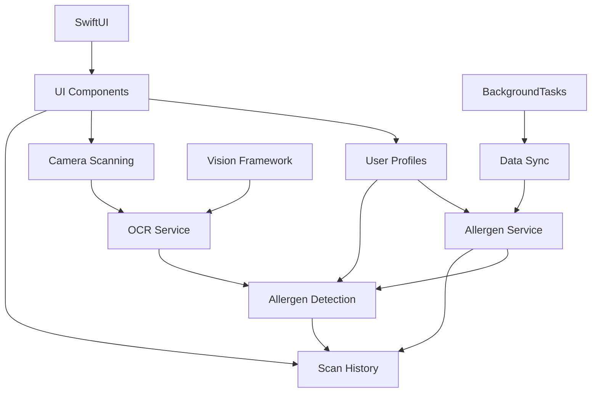

# AllerGuard Feature Dependencies

*Last Updated: February 28, 2025*

This document visualizes the dependencies between different features of AllerGuard and their relationship to Apple platform frameworks.

## Core Feature Dependencies

## Detailed Feature Dependencies

### Camera Scanning
- **Depends on**:
  - PermissionService (for camera access)
  - CameraService
  - AVFoundation framework
  - SwiftUI for camera UI components
- **Depended on by**:
  - OCR Service
  - Restaurant Menu Scanning (future)

### OCR Service
- **Depends on**:
  - Camera Scanning (for image input)
  - Vision Framework
  - CoreML (for enhanced text recognition)
- **Depended on by**:
  - Allergen Detection
  - Scan History (for displaying recognized text)
- **Apple Framework Requirements**:
  - Vision framework support (iOS 14+)
  - VisionKit for document scanning

### Allergen Service
- **Depends on**:
  - User Profiles (for allergen preferences)
  - Core Data (for allergen database)
  - BackgroundTasks framework (for database updates)
- **Depended on by**:
  - Allergen Detection
  - User Profiles (for allergen information)
  - Scan History (for allergen display)
  - Allergen Education (future)
  - Alternative Suggestions (future)

### Allergen Detection
- **Depends on**:
  - OCR Service (for ingredient text)
  - Allergen Service (for allergen matching)
  - User Profiles (for user allergens)
  - NaturalLanguage framework (for ingredient analysis)
- **Depended on by**:
  - Scan History
  - Alternative Suggestions (future)
  - Community Features (future)

### User Profiles
- **Depends on**:
  - StorageService
  - Allergen Service (for allergen list)
  - SwiftUI for profile UI
  - CloudKit (for profile sync)
- **Depended on by**:
  - Allergen Detection
  - Scan History
  - Emergency Contacts (future)

### Scan History
- **Depends on**:
  - StorageService
  - OCR Service (for displaying text)
  - Allergen Detection (for displaying results)
  - User Profiles (for profile-specific history)
  - SwiftUI for history UI
- **Depended on by**:
  - Community Features (future)

## Apple Platform Dependencies

### UI Framework Dependencies
- **SwiftUI**: Primary UI framework for all new views
  - Required by: All UI components
  - Features relying on: Dynamic Type, Dark Mode, Accessibility
  - Minimum version: iOS 14+

### System Framework Dependencies
- **Vision Framework**: For OCR and image analysis
  - Required by: OCR Service, Menu Recognition
  - Minimum version: iOS 14+ (for enhanced text recognition)

- **CoreML**: For ingredient classification models
  - Required by: Allergen Detection
  - Minimum version: iOS 14+

- **NaturalLanguage**: For ingredient text analysis
  - Required by: OCR Service, Allergen Detection
  - Minimum version: iOS 14+

- **BackgroundTasks**: For background data updates
  - Required by: Allergen database updates, restaurant data refreshes
  - Minimum version: iOS 13+

- **CloudKit**: For user data synchronization
  - Required by: User Profiles (optional)
  - Minimum version: iOS 13+

### Design Dependencies
- **SF Symbols**: For consistent iconography
  - Required by: All UI components
  - Minimum version: iOS 14+ (for SF Symbols 2)

- **Human Interface Guidelines**:
  - Navigation patterns: Tab-based, hierarchical navigation
  - Alerts and modals: For critical allergen warnings
  - Typography: Dynamic Type support required

## Feature Impact Analysis

| Feature Change | Impact Areas | Apple Platform Considerations | Risk Level |
|----------------|--------------|-------------------------------|------------|
| Camera Service | Camera Scanning, OCR | AVFoundation privacy permissions | High |
| OCR Algorithm | OCR Service, Allergen Detection, Scan History | Vision framework version dependencies | High |
| Allergen Database | Allergen Service, Allergen Detection, User Profiles | Core Data concurrency, background updates | Medium |
| User Profile Model | User Profiles, Allergen Detection, Scan History | CloudKit sync, Core Data relationships | Medium |
| Storage Implementation | User Profiles, Scan History | Core Data, app lifecycle events | Medium |
| UI Components | All features | SwiftUI lifecycle, accessibility | Low |

## Isolation Strategies

To maintain feature isolation and prevent cascading changes:

1. **Service Interfaces**: All services expose stable interfaces
2. **Feature Facades**: Each feature exposes a single facade for external access
3. **Data Transfer Objects**: Use DTOs for cross-feature communication
4. **Dependency Injection**: Inject dependencies rather than importing directly
5. **Event-Based Communication**: Use Combine publishers for loose coupling
6. **Lifecycle Management**: Respect Apple platform lifecycle events
   - Use appropriate `onAppear`/`onDisappear` hooks in SwiftUI
   - Handle app state changes (background, foreground)
   - Properly subscribe/unsubscribe from publishers
7. **Platform Compatibility**: Use availability checks for newer API features
   - Implement fallbacks for older iOS versions
   - Use feature detection over version checks

## Phased Development Dependencies

Phase 1 (Core Features):
- User Profiles must be implemented before Allergen Detection
- Camera Scanning must be implemented before OCR
- OCR and Allergen Service must be implemented before Allergen Detection
- Allergen Detection must be functional before Scan History
- SwiftUI & SF Symbols must be implemented for all UI components

Phase 2 (Enhanced Features):
- Core features must be stable before Enhanced features
- Allergen Service enhancements required for Allergen Education
- User Profiles must support Emergency Contact storage
- BackgroundTasks framework integration for data refreshes

Phase 3 (Future Features):
- Scan History sharing APIs needed for Community Features
- Enhanced OCR required for Restaurant Menu Scanning
- CloudKit integration for cross-device synchronization 