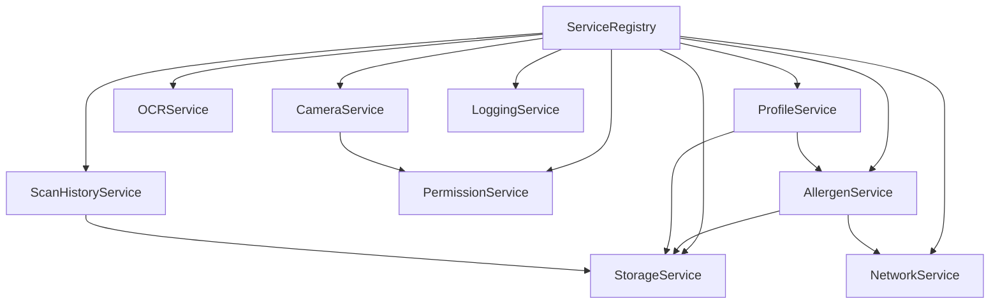

# AllerGuard Service Registry

*Last Updated: February 27, 2025*

This document serves as the central registry for all services in the AllerGuard application, including their responsibilities, interfaces, and dependencies.

## Core Services

### MenuService

**Purpose**: Manages restaurant menu processing, filtering, and substitution recommendations.

**Responsibilities**:
- Menu scanning and parsing
- Menu item filtering based on allergen profiles
- Substitution recommendations
- Menu history management
- Restaurant information integration

**Interface**:
```swift
protocol MenuServiceProtocol {
    func parseMenu(from image: UIImage) async -> Result<ParsedMenu, MenuError>
    func filterMenuItems(menu: ParsedMenu, profile: AllergenProfile) -> FilteredMenu
    func getSafeMenuItems(menu: ParsedMenu, profile: AllergenProfile) -> [MenuItem]
    func getUnsafeMenuItems(menu: ParsedMenu, profile: AllergenProfile) -> [MenuItem]
    func getCautionMenuItems(menu: ParsedMenu, profile: AllergenProfile) -> [MenuItem]
    func getSubstitutionOptions(for item: MenuItem, profile: AllergenProfile) -> [Substitution]
    func saveMenuHistory(menu: ParsedMenu, restaurant: Restaurant?) throws
    func getRecentMenus(limit: Int) throws -> [MenuHistory]
    
    var recentMenusPublisher: AnyPublisher<[MenuHistory], Error> { get }
}
```

**Dependencies**:
- OCRService
- AllergenService
- StorageService
- RestaurantService

**Initialization**:
```swift
let menuService = MenuService(
    ocrService: ocrService,
    allergenService: allergenService,
    storageService: storageService,
    restaurantService: restaurantService
)
```

---

### RestaurantService

**Purpose**: Manages restaurant data and associated menus.

**Responsibilities**:
- Restaurant database management
- Menu database integration
- Location-based restaurant search
- Restaurant allergen policy information
- User restaurant preferences

**Interface**:
```swift
protocol RestaurantServiceProtocol {
    func searchRestaurants(by name: String) async -> [Restaurant]
    func searchRestaurants(near location: CLLocation, radius: Double) async -> [Restaurant]
    func getRestaurantDetails(id: String) async -> RestaurantDetails?
    func getRestaurantAllergenPolicy(id: String) async -> AllergenPolicy?
    func saveUserRestaurantPreference(restaurant: Restaurant, isFavorite: Bool) throws
    func getUserFavoriteRestaurants() throws -> [Restaurant]
    func getRestaurantMenus(id: String) async -> [Menu]
    func saveRestaurantMenu(restaurantID: String, menu: ParsedMenu) throws
    
    var favoriteRestaurantsPublisher: AnyPublisher<[Restaurant], Error> { get }
}
```

**Dependencies**:
- StorageService
- NetworkService
- LocationService

**Initialization**:
```swift
let restaurantService = RestaurantService(
    storageService: storageService,
    networkService: networkService,
    locationService: locationService
)
```

---

### SubstitutionService

**Purpose**: Manages substitution recommendations for menu items containing allergens.

**Responsibilities**:
- Substitution database management
- Ingredient substitution matching
- Restaurant-specific substitution options
- User substitution preferences
- Substitution feasibility analysis

**Interface**:
```swift
protocol SubstitutionServiceProtocol {
    func getSubstitutions(for allergen: Allergen) -> [Substitution]
    func getSubstitutions(for ingredient: String) -> [Substitution]
    func getViableSubstitutions(for menuItem: MenuItem, profile: AllergenProfile) -> [MenuSubstitution]
    func saveUserSubstitutionPreference(original: String, substitute: String, preferred: Bool) throws
    func getUserPreferredSubstitutions() throws -> [UserSubstitution]
    func analyzeSubstitutionFeasibility(menuItem: MenuItem, substitutions: [Substitution]) -> FeasibilityScore
    
    var userSubstitutionsPublisher: AnyPublisher<[UserSubstitution], Error> { get }
}
```

**Dependencies**:
- StorageService
- AllergenService

**Initialization**:
```swift
let substitutionService = SubstitutionService(
    storageService: storageService,
    allergenService: allergenService
)
```

---

### CameraService

**Purpose**: Manages camera access, configuration, and image capture.

**Responsibilities**:
- Camera initialization and configuration
- Image capture and processing
- Camera permission handling
- Focus and exposure management
- Image stabilization
- Menu-specific capture optimization

**Interface**:
```swift
protocol CameraServiceProtocol {
    var isAvailable: Bool { get }
    var currentPermissionStatus: PermissionStatus { get }
    
    func requestCameraAccess() async -> PermissionStatus
    func setupCamera() async throws
    func startCameraPreview(in view: UIView) throws
    func stopCameraPreview()
    func captureImage() async throws -> UIImage
    func configureForScan() throws
    func configureForMenuScan() throws  // New method for menu scanning optimization
    func setFocusMode(_ mode: FocusMode)
    func tearDown()
    
    var previewLayer: CALayer? { get }
}
```

**Dependencies**:
- AVFoundation
- PermissionService

**Initialization**:
```swift
let cameraService = CameraService(permissionService: permissionService)
```

---

### OCRService

**Purpose**: Performs optical character recognition on images to extract ingredient text and menu content.

**Responsibilities**:
- Text recognition from images
- Text preprocessing and cleaning
- Language detection
- Confidence scoring
- Layout analysis for ingredient labels and menus
- Menu structure detection

**Interface**:
```swift
protocol OCRServiceProtocol {
    func recognizeText(from image: UIImage) async -> Result<RecognizedText, OCRError>
    func recognizeIngredientList(from image: UIImage) async -> Result<IngredientsResult, OCRError>
    func recognizeMenu(from image: UIImage) async -> Result<MenuTextResult, OCRError>  // New method for menu recognition
    func detectLanguage(in text: String) -> String?
    func extractStructuredIngredients(from text: String) -> [String]
    func extractMenuItems(from text: String) -> [MenuItemText]  // New method for menu item extraction
    func detectMenuSections(from text: String) -> [MenuSection]  // New method for menu section detection
}
```

**Dependencies**:
- Vision framework
- CoreImage
- NaturalLanguage

**Initialization**:
```swift
let ocrService = OCRService()
```

---

### AllergenService

**Purpose**: Manages allergen data and performs detection in ingredient lists.

**Responsibilities**:
- Allergen database management
- Allergen matching algorithms
- Synonym and variant detection
- Confidence scoring for matches
- Hidden allergen identification

**Interface**:
```swift
protocol AllergenServiceProtocol {
    func getAllergens() -> [Allergen]
    func getCommonAllergens() -> [Allergen]
    func getUserAllergens(for userID: String) -> [Allergen]
    func detectAllergens(in ingredients: [String], userProfiles: [AllergenProfile]?) -> [AllergenMatch]
    func analyzeConfidence(for match: AllergenMatch) -> ConfidenceLevel
    func updateAllergenDatabase() async throws
    func findHiddenAllergens(in ingredients: [String]) -> [AllergenMatch]
}
```

**Dependencies**:
- StorageService (for allergen database)
- CoreData

**Initialization**:
```swift
let allergenService = AllergenService(storageService: storageService)
```

---

### StorageService

**Purpose**: Manages data persistence for the application.

**Responsibilities**:
- Core Data stack initialization and management
- User profile storage
- Scan history persistence
- Menu scan history persistence
- Restaurant data storage
- Allergen database management
- Image storage (paths only, not raw data)

**Interface**:
```swift
protocol StorageServiceProtocol {
    // User Profiles
    func saveProfile(_ profile: AllergenProfile) throws
    func fetchProfiles() throws -> [AllergenProfile]
    func fetchProfile(with id: String) throws -> AllergenProfile?
    func deleteProfile(with id: String) throws
    
    // Scan History
    func saveScanResult(_ result: ScanResult) throws
    func fetchScanHistory(limit: Int, offset: Int) throws -> [ScanResult]
    func fetchScanHistory(for profileID: String) throws -> [ScanResult]
    func deleteScanResult(with id: String) throws
    
    // Menu History
    func saveMenuScan(_ menuScan: MenuScanResult) throws
    func fetchMenuHistory(limit: Int, offset: Int) throws -> [MenuScanResult]
    func fetchMenuHistory(for profileID: String) throws -> [MenuScanResult]
    func fetchMenuHistory(for restaurantID: String) throws -> [MenuScanResult]
    func deleteMenuScan(with id: String) throws
    
    // Restaurant Data
    func saveRestaurant(_ restaurant: Restaurant) throws
    func fetchRestaurants() throws -> [Restaurant]
    func fetchRestaurant(with id: String) throws -> Restaurant?
    func fetchFavoriteRestaurants() throws -> [Restaurant]
    func deleteRestaurant(with id: String) throws
    
    // Allergen Database
    func fetchAllergenDatabase() throws -> AllergenDatabase
    func updateAllergenDatabase(_ database: AllergenDatabase) throws
    
    // Substitution Database
    func fetchSubstitutionDatabase() throws -> SubstitutionDatabase
    func updateSubstitutionDatabase(_ database: SubstitutionDatabase) throws
    func fetchUserSubstitutions() throws -> [UserSubstitution]
    func saveUserSubstitution(_ substitution: UserSubstitution) throws
    
    // Image Storage
    func saveImage(_ image: UIImage, for scanID: String) throws -> URL
    func fetchImage(for scanID: String) throws -> UIImage?
    func deleteImage(for scanID: String) throws
}
```

**Dependencies**:
- CoreData
- FileManager

**Initialization**:
```swift
let storageService = StorageService(modelName: "AllerGuard")
```

---

### PermissionService

**Purpose**: Manages system permissions required by the application.

**Responsibilities**:
- Camera permission handling
- Photo library access
- Notification permissions
- Location services (for emergency features)
- Permission status tracking

**Interface**:
```swift
protocol PermissionServiceProtocol {
    func checkCameraPermission() async -> PermissionStatus
    func requestCameraPermission() async -> PermissionStatus
    func checkPhotoLibraryPermission() async -> PermissionStatus
    func requestPhotoLibraryPermission() async -> PermissionStatus
    func checkNotificationPermission() async -> PermissionStatus
    func requestNotificationPermission() async -> PermissionStatus
    func checkLocationPermission() async -> PermissionStatus
    func requestLocationPermission() async -> PermissionStatus
    
    var cameraPermissionPublisher: AnyPublisher<PermissionStatus, Never> { get }
    var notificationPermissionPublisher: AnyPublisher<PermissionStatus, Never> { get }
}
```

**Dependencies**:
- AVFoundation
- PhotosUI
- UserNotifications
- CoreLocation

**Initialization**:
```swift
let permissionService = PermissionService()
```

## Feature-Specific Services

### ProfileService

**Purpose**: Manages user allergen profiles.

**Responsibilities**:
- Profile creation and management
- Allergen sensitivity settings
- Profile switching
- Default profile management

**Interface**:
```swift
protocol ProfileServiceProtocol {
    func createProfile(name: String, allergens: [AllergenSensitivity]) throws -> AllergenProfile
    func updateProfile(_ profile: AllergenProfile) throws
    func getProfiles() throws -> [AllergenProfile]
    func getDefaultProfile() throws -> AllergenProfile?
    func setDefaultProfile(_ profile: AllergenProfile) throws
    func deleteProfile(_ profile: AllergenProfile) throws
    
    var profilesPublisher: AnyPublisher<[AllergenProfile], Error> { get }
    var currentProfilePublisher: AnyPublisher<AllergenProfile?, Error> { get }
}
```

**Dependencies**:
- StorageService
- AllergenService

**Initialization**:
```swift
let profileService = ProfileService(storageService: storageService, allergenService: allergenService)
```

---

### ScanHistoryService

**Purpose**: Manages the history of previous scans and results.

**Responsibilities**:
- Scan result storage
- History retrieval and filtering
- Result sharing
- Scan analytics

**Interface**:
```swift
protocol ScanHistoryServiceProtocol {
    func saveScan(result: ScanResult, image: UIImage?) throws
    func getRecentScans(limit: Int) throws -> [ScanResult]
    func getScans(for profile: AllergenProfile) throws -> [ScanResult]
    func getScans(from: Date, to: Date) throws -> [ScanResult]
    func getScans(containing allergen: Allergen) throws -> [ScanResult]
    func deleteScan(_ scan: ScanResult) throws
    func getScanImage(for scan: ScanResult) throws -> UIImage?
    
    var recentScansPublisher: AnyPublisher<[ScanResult], Error> { get }
}
```

**Dependencies**:
- StorageService
- ProfileService

**Initialization**:
```swift
let scanHistoryService = ScanHistoryService(storageService: storageService)
```

## Utility Services

### LoggingService

**Purpose**: Centralizes logging throughout the application.

**Responsibilities**:
- Debug logging
- Error logging
- Analytics events
- Performance monitoring

**Interface**:
```swift
protocol LoggingServiceProtocol {
    func debug(_ message: String, file: String, line: Int, function: String)
    func info(_ message: String, file: String, line: Int, function: String)
    func warning(_ message: String, file: String, line: Int, function: String)
    func error(_ message: String, error: Error?, file: String, line: Int, function: String)
    func logEvent(_ event: String, parameters: [String: Any]?)
    func startPerformanceMonitoring(identifier: String)
    func stopPerformanceMonitoring(identifier: String)
}
```

**Dependencies**:
- OSLog
- Analytics framework (optional)

**Initialization**:
```swift
let loggingService = LoggingService(subsystem: "com.allerguard", category: "app")
```

---

### NetworkService

**Purpose**: Handles network operations for allergen database updates and potential future online features.

**Responsibilities**:
- API communication
- Network status monitoring
- Request retry logic
- Response caching

**Interface**:
```swift
protocol NetworkServiceProtocol {
    func fetch<T: Decodable>(from endpoint: Endpoint) async throws -> T
    func downloadData(from url: URL) async throws -> Data
    func uploadData(_ data: Data, to endpoint: Endpoint) async throws -> NetworkResponse
    func cancelAllRequests()
    
    var networkStatusPublisher: AnyPublisher<NetworkStatus, Never> { get }
}
```

**Dependencies**:
- URLSession
- Combine

**Initialization**:
```swift
let networkService = NetworkService()
```

## Service Lifecycle Management

### ServiceRegistry

**Purpose**: Central registry for all services, facilitating dependency injection and service lifecycle management.

**Responsibilities**:
- Service registration and retrieval
- Dependency resolution
- Service lifecycle management

**Interface**:
```swift
class ServiceRegistry {
    static let shared = ServiceRegistry()
    
    func register<T>(_ service: T, for type: T.Type)
    func get<T>(_ type: T.Type) -> T?
    func resetAll()
}
```

**Usage Example**:
```swift
// Registration
ServiceRegistry.shared.register(cameraService, for: CameraServiceProtocol.self)

// Retrieval
if let cameraService = ServiceRegistry.shared.get(CameraServiceProtocol.self) {
    // Use camera service
}
```

## Service Dependencies Graph

